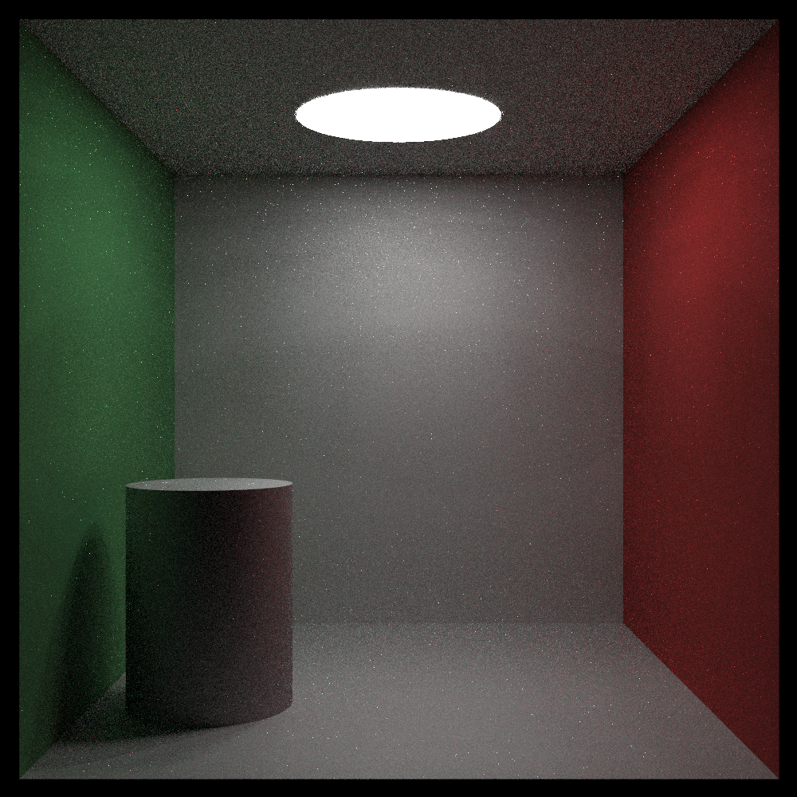
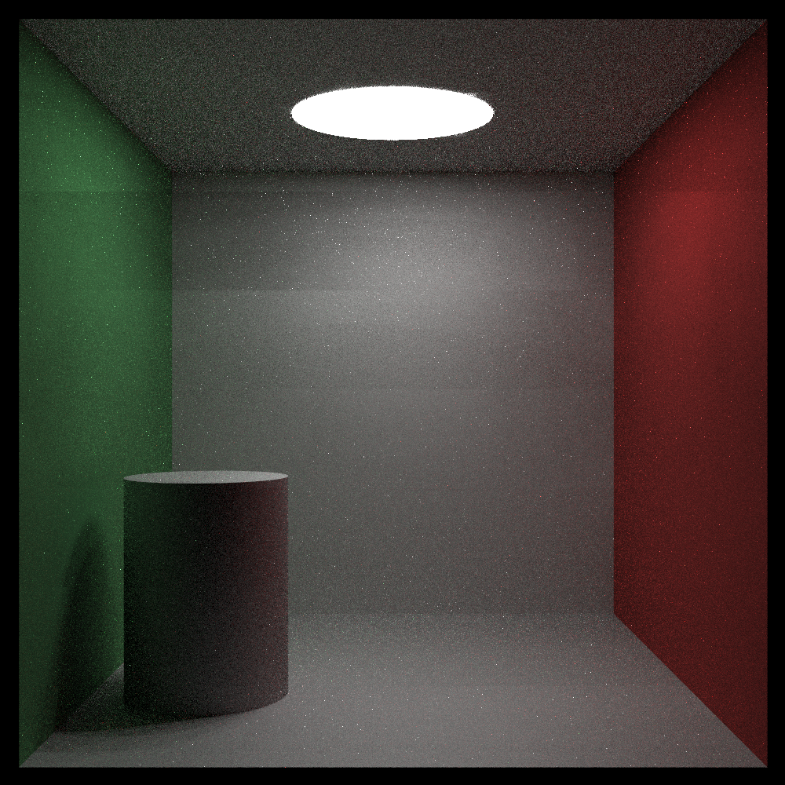
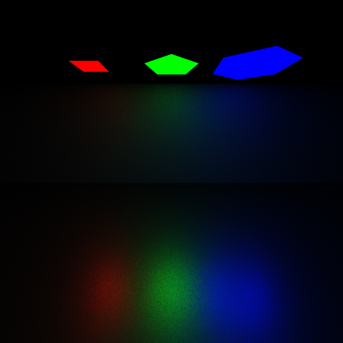

# GraphicsRender
## Path Tracing

Model:

* Sangonomiya Kokomi/miHoYo/观海子
* Bunny/Standford University

1000x1000 spp3000:

2000x2000 spp3000:

## Sampler

All 1000x1000 spp16.

Use different sampler in light sampling.

### Uniform

### Random

### Blue Noise

## Microfacet Model & Multiple importance sampling

| $\alpha$ |       BRDF Sampling       |      Light Sampling       | Multiple importance sampling |
| :------: | :-----------------------: | :-----------------------: | :--------------------------: |
|   0.01   |  |  |     |
|   0.1    |  |  |     |
|   0.2    |  |  |     |

